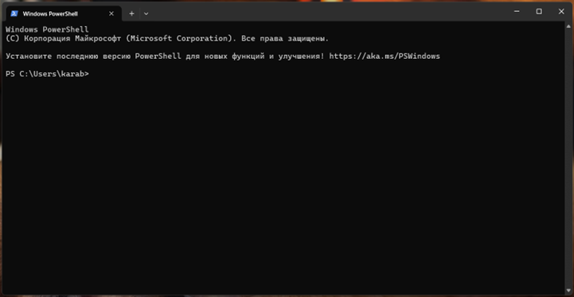
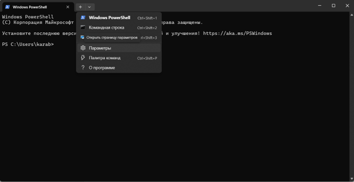
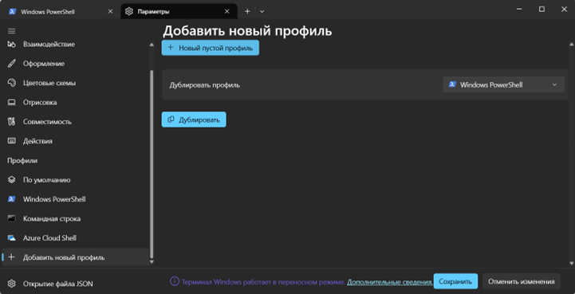
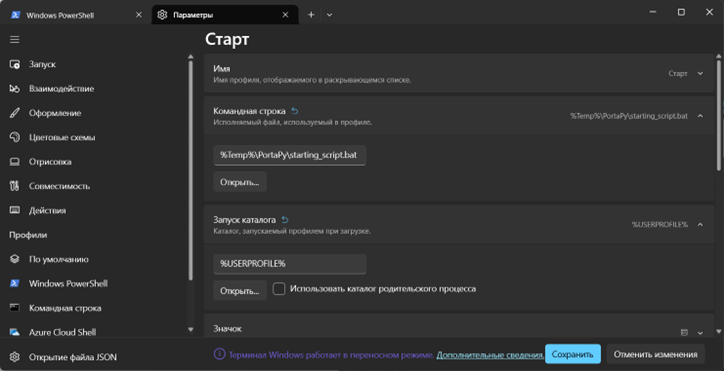
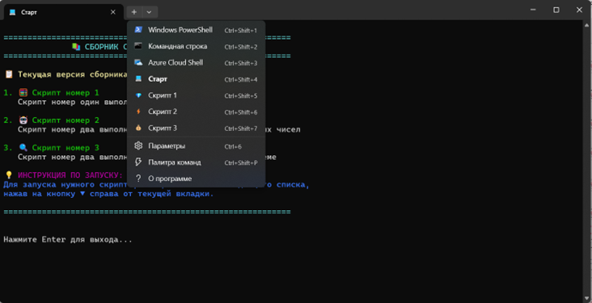
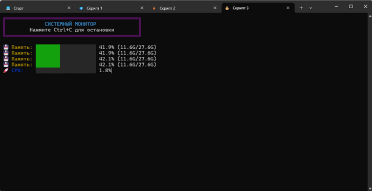

# Создание портативного комплекса скриптов на Python
## Введение

Данный мануал описывает процесс создания **портативного комплекса скриптов на Python**, который использует связку портативного терминала Windows и портативной версии Python. Этот подход позволяет запускать несколько скриптов в единой, удобной оболочке с современным интерфейсом, не требуя установки Python или настройки окружения на целевом компьютере.

---

## I. Подготовка компонентов

### 1. Создание рабочей папки
Создайте корневую папку для проекта. В данном примере используется имя `<PortaPy>`.

### 2. Загрузка портативного терминала Windows
Скачайте исполняемый файл портативной версии терминала Windows (файл `<wtp_user.exe>`) и поместите его в папку `<PortaPy>`.
*   **Источник:** `https://github.com/asheroto/Terminal-Portable`

### 3. Загрузка и распаковка портативного Python
Скачайте архив портативной версии дистрибутива Python и распакуйте его содержимое в папку `<PortaPy>`.
*   **Источник:** `https://sourceforge.net/projects/portable-python/files/latest/download`

### 4. Переименование папки Python
Переименуйте папку с распакованным Python в `<PortablePython>` для упрощения дальнейших настроек.

### 5. Размещение скриптов
Разместите ваши скрипты в папке `<PortaPy\PortablePython\App\Scripts>`. Рекомендуется создавать отдельную подпапку для каждого скрипта (например, `<PortaPy\PortablePython\App\Scripts\Start_script\main.py>`).

### 6. Установка зависимостей
Если ваши скрипты используют сторонние библиотеки, установите их с помощью `pip` через консоль портативного Python.
1.  Запустите файл `Console-Launcher.exe` из папки `<PortablePython>`.
2.  Используйте команду `pip install <название_библиотеки>` для установки необходимых пакетов.

---

## II. Настройка запускающего файла (start.bat)

### 7. Создание файла `start.bat`
В папке `<PortaPy>` создайте файл `start.bat` со следующим содержимым. Этот файл будет служить для запуска всего комплекса.

```batch
@echo off
chcp 65001 >nul
echo please wait...

:: Настройки путей
set "TARGET_PATH=%temp%\PortaPy"
set "TERMINAL_EXE=%TARGET_PATH%\Terminal\wt.exe"
set "SFX_ARCHIVE=wtp_user.exe"

:: Создаём папку TARGET_PATH, если её нет
if not exist "%TARGET_PATH%" mkdir "%TARGET_PATH%"

:: Записываем путь к папке БЕЗ перевода строки (в UTF-8)
set "CALLER_PATH=%~dp0"
set "CALLER_PATH=%CALLER_PATH:~0,-1%"

powershell -command "Set-Content -Path '%TARGET_PATH%\path_call.txt' -Value '%CALLER_PATH%' -Encoding UTF8 -NoNewline" >nul 2>&1

:: Запускаем распаковку и терминал
"%SFX_ARCHIVE%"

exit
```

**Функции `start.bat`:**
*   Создает временную папку `%Temp%\PortaPy`.
*   Записывает полный путь к папке `<PortaPy>` в файл `%Temp%\PortaPy\path_call.txt`.
*   Запускает SFX-архив `<wtp_user.exe>`, который распаковывает файлы терминала во временную папку.

### 8. Редактирование SFX-архива `<wtp_user.exe>`
Для корректной работы необходимо изменить путь распаковки в SFX-архиве терминала.

1.  Откройте файл `<wtp_user.exe>` с помощью архиватора **WinRAR**.
2.  Нажмите кнопку **"SFX"** в меню.
3.  В открывшемся окне нажмите **"Дополнительные параметры SFX"**.
4.  **Раздел "Общие":**
    *   В поле **"Путь для распаковки"** замените `%temp%\Terminal-Portable` на `%temp%\PortaPy`.
5.  **Раздел "Установка":**
    *   В поле **"Выполнить после распаковки"** замените `"%temp%\Terminal-Portable\Terminal\wt.exe"` на `"%temp%\PortaPy\Terminal\wt.exe"`.
    *   В поле **"Выполнить перед распаковкой"** **удалите** команду `rmdir "%temp%\Terminal-Portable" /s /q`.
6.  Сохраните изменения, нажав **"ОК"**.

---

## III. Создание BAT-файлов для скриптов

### 9. Создание BAT-файлов для запуска скриптов
Для каждого скрипта создайте отдельный BAT-файл, каждый из которых на следующем шаге включим в SFX-архив терминала Windows. Эти файлы будут запускаться из терминала и использовать портативный Python.

**Шаблон содержимого BAT-файла:**
```batch
@echo off

chcp 65001 >nul

:: echo The app is launching, please wait...
:: Читаем путь из файла в UTF-8 через PowerShell
for /f "delims=" %%i in ('powershell -command "[System.IO.File]::ReadAllText('%~dp0path_call.txt', [System.Text.Encoding]::UTF8).Trim()"') do set "BASE_PATH=%%i"

if not exist "%BASE_PATH%" (
    echo ERROR: Base path %BASE_PATH% does not exist!
    pause
    exit /b
)

set "PY_PATH=%BASE_PATH%\PortablePython\App\Scripts\ Start_script\main.py"

if not exist "%PY_PATH%" (
    echo ERROR: py-file not found on path %PY_PATH%
    pause
    exit /b
)

:: Запускаем Python с использованием прочитанного пути
"%BASE_PATH%\PortablePython\App\Python\python.exe" "%PY_PATH%"

echo The window can be closed.

pause
```

**Пример конфигурации для нескольких скриптов:**

| Имя BAT-файла | Значение переменной `PY_PATH` |
| :--- | :--- |
| `starting_script.bat` | `set "PY_PATH=%BASE_PATH%\PortablePython\App\Scripts\Start_script\main.py"` |
| `timer.bat` | `set "PY_PATH=%BASE_PATH%\PortablePython\App\Scripts\Timer\main.py"` |
| `random_number_generator.bat` | `set "PY_PATH=%BASE_PATH%\PortablePython\App\Scripts\RandomNumberGenerator\main.py"` |
| `information_system.bat` | `set "PY_PATH=%BASE_PATH%\PortablePython\App\Scripts\Information System\main.py"` |

### 10. Включение BAT-файлов в SFX-архив
Чтобы BAT-файлы были доступны терминалу, их необходимо включить в SFX-архив.

1.  Откройте файл `<wtp_user.exe>` с помощью архиватора **WinRAR**.
2.  Оставаясь в корне архива, используйте кнопку **"Добавить файл(ы) в архив"** для включения всех созданных BAT-файлов в состав SFX-архива.

---

## IV. Настройка профилей терминала

### 11. Первый запуск комплекса
Запустите файл `<start.bat>` и дождитесь появления окна терминала Windows.


### 12. Переход в настройки
В открывшемся окне терминала нажмите на стрелку **"v"** рядом с вкладкой и выберите **"Параметры"**.

### 13. Создание нового профиля
Для каждого скрипта необходимо создать отдельный профиль.
1.  В левом нижнем углу окна "Параметры" нажмите **"Добавить новый профиль"**.
2.  Выберите **"Новый пустой профиль"**.


### 14. Конфигурация профиля
Заполните поля нового профиля:

| Поле | Описание | Пример значения |
| :--- | :--- | :--- |
| **Имя** | Удобное для пользователя название скрипта. | `Стартовый скрипт` |
| **Командная строка** | Путь к BAT-файлу скрипта во временной папке. | `%Temp%\PortaPy\starting_script.bat` |
| **Запуск каталога** | Снимите галочку с пункта **"Использовать каталог родительского процесса"**. | |


> **Примечание:** Вы можете настроить внешний вид профиля (значок, цвета, шрифт) по своему усмотрению.

### 15. Сохранение изменений
Нажмите кнопку **"Сохранить"**.

### 16. Настройка стартового профиля
Установите один из профилей в качестве стартового, который будет запускаться по умолчанию при открытии терминала.
1.  Перейдите в раздел **"Запуск"** в настройках.
2.  В поле **"Профиль по умолчанию"** выберите нужный скрипт (например, `Стартовый скрипт`).
3.  Нажмите **"Сохранить"**.
   


### 17. Проверка и повторение
1.  Закройте окно терминала и запустите файл `<start.bat>` для проверки работы стартового скрипта.

2.  Повторите шаги **13-15** для каждого скрипта, используя следующие параметры:

| Скрипт | Имя профиля | Командная строка |
| :--- | :--- | :--- |
| `starting_script.bat` | `Старт` | `%Temp%\PortaPy\starting_script.bat` |
| `timer.bat` | `Скрипт 1` | `%Temp%\PortaPy\timer.bat` |
| `random_number_generator.bat` | `Скрипт 2` | `%Temp%\PortaPy\random_number_generator.bat` |
| `information_system.bat` | `Скрипт 3` | `%Temp%\PortaPy\information_system.bat` |

### 18. Управление профилями
Проверьте, что все созданные профили доступны в списке вкладок. При необходимости вы можете удалить стандартные профили (Windows PowerShell, Командная строка и т.д.) через раздел **"Параметры"**, выбрав профиль и нажав **"Удалить профиль"**.


---

## V. Финализация и обеспечение портативности

### 19. Проверка работы
Проверьте работу всех скриптов, запустив соответствующие вкладки в терминале.


### 20. Включение файла настроек в SFX-архив
Для сохранения созданных профилей и обеспечения портативности необходимо включить файл настроек терминала (`settings.json`) в SFX-архив.

1.  **Найдите файл `settings.json`:**
    *   Вставьте путь `%Temp%\PortaPy\Terminal\settings` в строку поиска Windows (или в адресную строку Проводника).
    *   Откроется папка, содержащая файл `settings.json`.
2.  **Включите файл в SFX-архив:**
    *   Откройте файл `<wtp_user.exe>` с помощью архиватора **WinRAR**.
    *   Перейдите внутри архива в папку `<Terminal>`.
    *   Создайте новую папку `<settings>` внутри `<Terminal>`.
    *   Используйте кнопку **"Добавить файл(ы) в архив"** для включения файла `settings.json` (найденного в п. 1) в созданную папку `<Terminal\settings>` внутри архива.

**Итог:** Сформированная папка `<PortaPy>` теперь является полностью портативным комплексом, который можно переносить на другие носители или компьютеры и запускать скрипты без необходимости установки Python.
